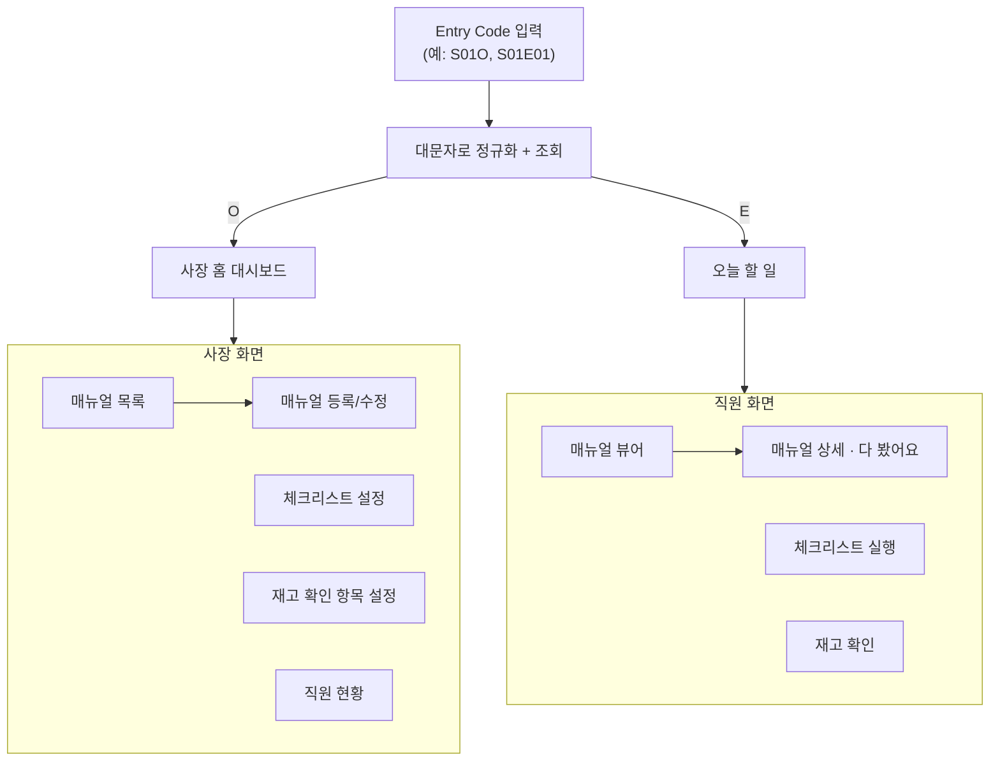
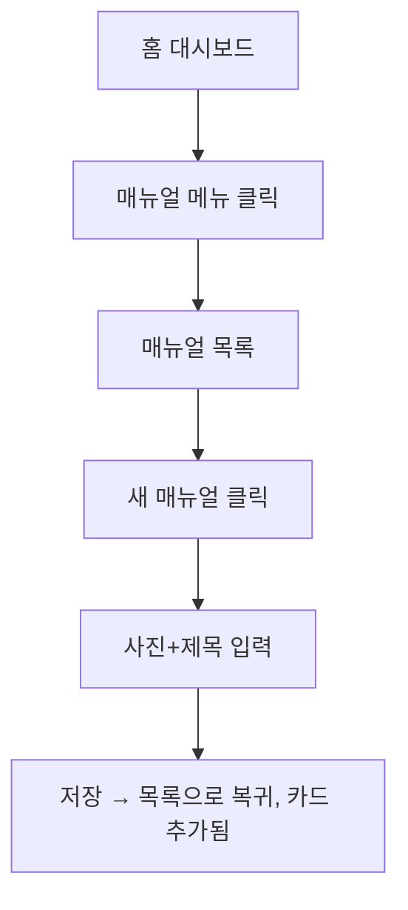

# TongssApp/docs/03_USER_FLOW — 사용자 흐름

> **문서 소유권:** 최종 수정 권한은 **Store PO(아론)**. 아래는 PM이 제시하는 초안이며, 공유 `../../docs/02_USER_FLOW.md`(전체 여정)의 1~2단계를 TongssApp 화면 단위로 상세화한 것.
> 👤 이 문서는 아론님이 "이 화면이 왜 필요하고, 뭐가 있어야 하는지" 이해하고 **Claude에게 그대로 요청할 수 있도록** 만들어졌습니다. 각 화면은 5가지로 구성됩니다: 🎯 목적 · 👀 화면에 보이는 것 · ✅ 할 수 있는 것 · 🤖 Claude에게 요청할 내용 · 📸 대략적인 화면 모양.
> 📸 아래 그림은 정확한 디자인이 아니라 "이런 배치다"를 보여주는 대략적인 스케치입니다. 실제 색·모양은 `07_DESIGN_SYSTEM.md`와 `design-system/index.html`을 따릅니다.

---

## 👤 전체 흐름도



> 이 그림은 VS Code에서 파일을 열면 자동으로 그림으로 렌더링됩니다. **앱은 하나입니다** — 사장용/직원용 앱이 따로 있는 게 아니라, Entry Code 조회 결과(O/E)로 화면만 갈라집니다.

---

## 0. 앱 진입 — Entry Code (사장·직원 공통)

> ⚠️ Tongss는 실제 로그인 시스템을 만들지 않습니다. 매장 등록도 없습니다 — 매장·직원 정보는 미리 준비됩니다 (`examples/MASHITA_BURGER.md` 참조). 사장·직원 모두 **같은 화면**에서 Entry Code만 입력하면 됩니다.

🎯 **목적:** 사장·직원이 별도 회원가입 없이, 코드 하나로 자기 매장·역할에 맞는 화면으로 바로 들어간다.

👀 **화면에 보이는 것**
- Entry Code 입력창 하나
- "입장" 버튼

✅ **사용자가 할 수 있는 것**
- 코드 입력 → 대문자로 자동 정규화(`s01o` → `S01O`) → 조회
- 코드 규칙: `S`+매장번호+`O`(사장) 또는 `S`+매장번호+`E`+직원번호(직원) — 예: `S01O`, `S01E01`
- 조회 성공 → 역할에 맞는 화면(사장 홈 대시보드 / 오늘 할 일)으로 이동
- 조회 실패 → "코드를 다시 확인해 주세요" 안내 (`06_VOICE_AND_TONE.md` 원칙)

🤖 **Claude에게 요청할 내용**
> "Entry Code 입력 화면을 만들어줘. 입력값은 항상 대문자로 정규화해서 처리하고(`s01o`, `S01o` 모두 `S01O`로), `store.json`/`staff.json`에서 해당 코드를 찾아 매장과 역할(사장/직원)을 판별해줘. 사장이면 `pages/owner/dashboard.html`로, 직원이면 `pages/staff/today.html`로 이동시켜줘. 코드를 못 찾으면 에러 메시지를 보여줘. 데이터 구조는 `05_DATA.md` 참조."

📸 **대략적인 화면 모양**
```
┌─────────────────────┐
│      Tongss           │
├─────────────────────┤
│  Entry Code            │
│  [____________]       │
│                       │
│     [ 입장 ]           │
└─────────────────────┘
```

---

## 사장(이대표) 화면

### 1. 홈 대시보드

🎯 **목적:** 사장이 앱을 열었을 때 가장 먼저 보는 화면. "오늘 매장이 어떤 상태인지" 한눈에 확인한다.

👀 **화면에 보이는 것**
- 오늘 재고 확인이 안 됐거나 "부족해요" 표시가 있으면 최상단 알림
- 직원별 체크리스트 완료 현황 (오늘)
- 직원별 매뉴얼 학습 완료율
- 메뉴: 매뉴얼 / 체크리스트 설정 / 재고 확인 항목 설정 / 직원 현황

✅ **사용자가 할 수 있는 것**
- 각 메뉴 탭 → 해당 화면으로 이동

🤖 **Claude에게 요청할 내용**
> "사장용 홈 대시보드를 만들어줘. 맨 위에는 오늘 재고 확인이 안 됐거나 '부족해요'로 표시된 항목이 있으면 알림 카드로 보여주고, 그 아래 직원별 체크리스트 완료 현황과 매뉴얼 학습 완료율을 카드로 보여줘. 메뉴 4개(매뉴얼/체크리스트 설정/재고 확인 항목 설정/직원 현황)로 이동하는 버튼도 필요해."

📸 **대략적인 화면 모양**
```
┌─────────────────────┐
│ 홈                    │
├─────────────────────┤
│ ⚠ 콜라시럽 부족해요     │
├─────────────────────┤
│ 오늘 체크리스트          │
│ 김스태프 ██████░░ 80%   │
├─────────────────────┤
│ 매뉴얼 학습률            │
│ 전체 75%               │
├─────────────────────┤
│ [매뉴얼] [체크리스트]     │
│ [재고 확인] [직원 현황]   │
└─────────────────────┘
```

---

### 2. 매뉴얼 목록 / 등록

🎯 **목적:** 사장이 매뉴얼을 5분 안에 올리고, 언제든 목록에서 확인·수정할 수 있게 한다.

👀 **화면에 보이는 것**
- 목록: 등록된 매뉴얼 카드(사진 썸네일 + 제목) + "새 매뉴얼" 버튼
- 등록 화면: 사진 업로드(1장 이상), 제목 입력, 짧은 설명(선택)

✅ **사용자가 할 수 있는 것**
- 사진 찍고 제목만 입력해도 저장 가능 (5분 이내 목표 — `../../docs/00_PRODUCT_GUIDE.md`)
- 카드 클릭 → 수정 화면

🤖 **Claude에게 요청할 내용**
> "매뉴얼 목록 화면(카드형, 사진+제목)과 등록 화면(사진 업로드+제목+선택 설명)을 만들어줘. 저장하면 목록으로 돌아가고 새 카드가 보여야 해. `createManualCard` 컴포넌트가 있으면 재사용해줘 (`04_COMPONENT_MAP.md` 참조)."

📸 **대략적인 화면 모양**
```
┌─────────────────────┐   ┌─────────────────────┐
│ 매뉴얼    [+ 새 매뉴얼]   │   │ 매뉴얼 등록             │
├─────────────────────┤   ├─────────────────────┤
│ [사진] 냉장고 청소법      │   │ [ 사진 추가 ]           │
│ [사진] 오픈 준비         │   │ 제목: [________]      │
│ [사진] 패티 해동         │   │ 설명(선택): [______]   │
└─────────────────────┘   │    [ 저장 ]            │
                           └─────────────────────┘
```

---

### 3. 체크리스트 설정

🎯 **목적:** 오픈·마감 때 직원이 뭘 확인해야 하는지 사장이 미리 정해둔다.

👀 **화면에 보이는 것**
- 오픈/마감 체크리스트 항목 목록
- 항목 추가/삭제 버튼

✅ **사용자가 할 수 있는 것**
- 항목 추가/삭제, 오픈/마감 구분 지정
- `[확인필요]` 기본 템플릿을 제공할지, 완전 빈 상태로 시작할지 — Store PO 결정

🤖 **Claude에게 요청할 내용**
> "오픈 체크리스트와 마감 체크리스트, 두 목록을 각각 관리하는 화면을 만들어줘. 항목을 추가/삭제할 수 있어야 해."

📸 **대략적인 화면 모양**
```
┌─────────────────────┐
│ 체크리스트 설정          │
├─────────────────────┤
│ 오픈                  │
│ · POS 로그인      [x]  │
│ · 냉장고 온도 확인   [x] │
│ [+ 항목 추가]          │
├─────────────────────┤
│ 마감                  │
│ · POS 마감 정산    [x]  │
│ [+ 항목 추가]          │
└─────────────────────┘
```

---

### 4. 재고 확인 항목 설정

🎯 **목적:** 사장이 "오늘 직원이 확인해야 할 재고 품목"을 정해둔다. **⚠️ 수량을 계산하는 화면이 아닙니다** — 재고 수량 관리는 토스플레이스가 이미 하고 있습니다. Tongss는 "직원이 확인했는지"만 기록합니다.

👀 **화면에 보이는 것**
- 확인 대상 품목 목록 (예: 패티, 번, 콜라시럽)
- 항목 추가/삭제 버튼

✅ **사용자가 할 수 있는 것**
- 품목 추가/삭제만 (수량·기준값 입력 없음)

🤖 **Claude에게 요청할 내용**
> "재고 확인 항목을 관리하는 화면을 만들어줘. 품목 이름만 추가/삭제하면 되고, 수량이나 기준값 입력란은 필요 없어."

📸 **대략적인 화면 모양**
```
┌─────────────────────┐
│ 재고 확인 항목           │
├─────────────────────┤
│ · 패티             [x] │
│ · 번               [x] │
│ · 콜라시럽           [x] │
│ [+ 품목 추가]          │
└─────────────────────┘
```

---

### 5. 직원 현황

🎯 **목적:** 사장이 "누가 뭘 익혔고 뭘 수행했는지" 직접 물어보지 않고 확인한다.

👀 **화면에 보이는 것**
- 직원별: 매뉴얼 학습 완료율, 최근 체크리스트·재고 확인 수행 여부

✅ **사용자가 할 수 있는 것**
- 직원 목록 확인 (조회 전용, 수정 없음)

🤖 **Claude에게 요청할 내용**
> "직원별로 매뉴얼 학습률과 최근 체크리스트·재고 확인 수행 여부를 보여주는 조회 화면을 만들어줘. 감시하는 느낌이 아니라 현황 공유하는 톤으로 (`../../docs/06_VOICE_AND_TONE.md` 참조)."

📸 **대략적인 화면 모양**
```
┌─────────────────────┐
│ 직원 현황               │
├─────────────────────┤
│ 김스태프                │
│ 학습 75% · 오늘 수행 ✅  │
├─────────────────────┤
│ 박주방                 │
│ 학습 100% · 오늘 수행 ✅ │
└─────────────────────┘
```

---

## 직원(김스태프) 화면

### 1. 진입

김스태프는 §0 "앱 진입 — Entry Code"를 그대로 씁니다 (예: `S01E01` = 1번 매장 1번 직원). QR 코드에 이 코드를 미리 담아두면 스캔만으로 자동 입력할 수도 있습니다 (`[확인필요]` 실제 QR 사용 여부, Store PO 결정).

**개인 식별은 Entry Code로 이미 해결됩니다** — 코드 자체가 "몇 번 직원인지"를 담고 있어서, 별도 이름 선택 단계가 필요 없습니다.

조회 성공 → "오늘 할 일" 화면으로 즉시 이동.

---

### 2. 오늘 할 일 (진입 직후 첫 화면)

🎯 **목적:** 지금 이 순간 뭘 해야 하는지 검색 없이 바로 보여준다.

👀 **화면에 보이는 것**
- 지금 시간대 기준 우선 노출 항목 (예: 마감 시간대면 "마감 체크리스트"가 최상단)
- 매뉴얼 바로가기, 재고 확인 바로가기

✅ **사용자가 할 수 있는 것**
- 항목 탭 → 해당 화면으로 즉시 이동 (검색 없이)

🤖 **Claude에게 요청할 내용**
> "지금 시간대(오픈/피크/마감)에 따라 가장 중요한 항목을 맨 위에 보여주는 '오늘 할 일' 화면을 만들어줘. `context.js`의 시간대 판별 로직을 써줘."

📸 **대략적인 화면 모양**
```
┌─────────────────────┐
│ 오늘 할 일               │
├─────────────────────┤
│ ⭐ 마감 체크리스트        │
│   (지금 시간대 우선)      │
├─────────────────────┤
│ 매뉴얼 보기              │
│ 재고 확인                │
└─────────────────────┘
```

---

### 3. 매뉴얼 뷰어

🎯 **목적:** 일하는 중에 3초 안에 답을 찾는다.

👀 **화면에 보이는 것**
- 매뉴얼 목록 (카테고리 없이 최근/자주 보는 순 — `[확인필요]` Store PO 결정)
- 상세: 사진 크게 + 짧은 텍스트, 스크롤 최소화

✅ **사용자가 할 수 있는 것**
- "다 봤어요" 체크 → 진행 표시로 반영 (감시 아님)

🤖 **Claude에게 요청할 내용**
> "매뉴얼 목록과 상세 화면을 만들어줘. 상세 화면은 사진이 크게 보이고 텍스트는 짧게, 스크롤이 거의 없어야 해. '다 봤어요' 버튼을 누르면 완료 표시가 남아야 해."

📸 **대략적인 화면 모양**
```
┌─────────────────────┐
│ 냉장고 청소법            │
├─────────────────────┤
│ [       사진       ]   │
│                       │
│ 월 1회, 문 안쪽까지 닦기  │
│                       │
│    [ 다 봤어요 ✓ ]      │
└─────────────────────┘
```

---

### 4. 체크리스트 실행

🎯 **목적:** 오픈·마감 업무를 실제로 했다는 걸 기록한다.

👀 **화면에 보이는 것**
- 오픈 또는 마감 체크리스트 항목 목록 (터치로 체크)

✅ **사용자가 할 수 있는 것**
- 항목 체크 → 즉시 저장, 완료율이 사장 대시보드에 반영

🤖 **Claude에게 요청할 내용**
> "체크리스트 항목을 터치하면 바로 체크되고 저장되는 화면을 만들어줘. 체크할 때마다 데이터에 즉시 반영되어야 해."

📸 **대략적인 화면 모양**
```
┌─────────────────────┐
│ 마감 체크리스트           │
├─────────────────────┤
│ ☑ POS 마감 정산         │
│ ☑ 현금 시재 확인         │
│ ☐ 재고 확인             │
│ ☐ 쓰레기 분리수거         │
└─────────────────────┘
```

---

### 5. 재고 확인

🎯 **목적:** ⚠️ **수량을 세는 화면이 아닙니다.** 오늘 정해진 품목을 확인했는지, 부족하면 부족하다고 표시하는 화면입니다.

👀 **화면에 보이는 것**
- 확인 대상 품목 목록 (사장이 "재고 확인 항목 설정"에서 정해둔 것)
- 각 품목 옆 "확인함" 체크 + "부족해요" 토글

✅ **사용자가 할 수 있는 것**
- 품목 체크 → 확인 기록
- 필요하면 "부족해요" 표시 → 사장 대시보드에 알림 반영

🤖 **Claude에게 요청할 내용**
> "재고 확인 화면을 만들어줘. 수량 입력란은 필요 없고, 품목마다 '확인함' 체크박스와 '부족해요' 토글만 있으면 돼. '부족해요'를 누르면 사장 대시보드에 알림으로 뜨게 해줘."

📸 **대략적인 화면 모양**
```
┌─────────────────────┐
│ 재고 확인                │
├─────────────────────┤
│ 패티     [확인함] [부족❗] │
│ 번       [확인함] [    ]  │
│ 콜라시럽  [확인함] [부족❗] │
└─────────────────────┘
```

---

## 👤 시나리오 (실제 하루 흐름)

### 시나리오 1 — 이대표: 매뉴얼 등록


### 시나리오 2 — 김스태프: 마감 체크 + 재고 확인
```mermaid
flowchart TD
    A[QR 진입] --> B[오늘 할 일<br/>마감 시간대라 마감 체크 우선 노출]
    B --> C[체크리스트 실행 → 4개 항목 체크]
    C --> D[재고 확인]
    D --> E[콜라시럽 "부족해요" 토글]
    E --> F[알림 발생 → 사장 대시보드에 반영]
```

---

## 🚨 이번엔 만들지 않을 것 (00_PRODUCT_GUIDE Out 참조)
```
❌ 회원가입/실제 로그인·비밀번호 (Entry Code로 대체, §0 참조)
❌ 매뉴얼 카테고리 분류 (Week 3 스코프 조정 시 고려)
❌ 재고 수량 계산/발주 자동화 — 토스플레이스 영역
❌ 다점포 통합 화면
```

---

## 💡 Future Vision — Face Check-in (아론 아이디어, MVP 범위 밖)

> 이번 스코프가 아닙니다. 위 "진입" 화면(직원 → QR/링크)과 혼동하지 마세요. 제품 차원 배경은 `../../docs/00_PRODUCT_GUIDE.md` §9 참조.

토스는 이미 Face 인증(페이스페이) 기능을 갖고 있습니다. 장기적으로는 김스태프의 "진입" 화면이 이렇게 바뀔 수 있습니다:

**Face 인증 → 출근 기록 생성 → 오늘 체크리스트 자동 표시 → 업무 시작**

**이번엔 이 정도만 (UI 목업, 실제 얼굴 인식 없음)**
```
김스태프
──────────────
😊 Face Verified
07:58
출근 완료
──────────────
오늘 해야 할 일
☑ 오픈 체크리스트
☐ 재고 확인
☐ 패티 해동
☐ 냉장고 온도 확인
──────────────
퇴근 예정
21:00
```

**만들지 않는 것:** Face Recognition 기술 자체. 화면에는 "향후 토스 플랫폼 기능과 연계 가능"이라고만 표시.

**실제로 화면을 만들기로 하면 필요한 것 (UI만)**
- 출퇴근 기록 화면
- 오늘 출근 여부
- 출근 시간 / 퇴근 시간
- 근무 상태

---

## 리뷰 세션 안건
1. `[확인필요]` 표시 전부 — QR 코드 실제 사용 여부, 체크리스트 기본 템플릿, 매뉴얼 정렬 기준
2. 이 문서 확정 후 `04_COMPONENT_MAP.md`의 화면 단위와 1:1 매칭 확인
