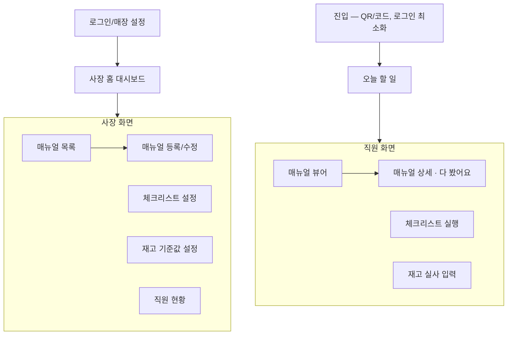
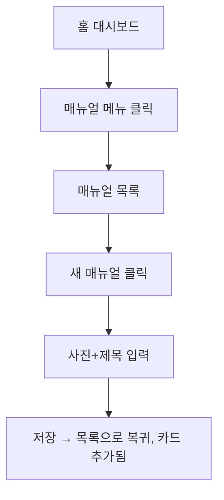
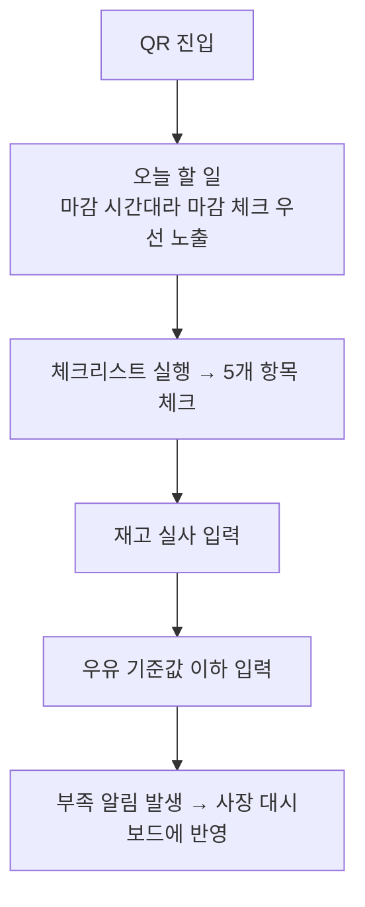

# TongssApp/docs/03_USER_FLOW — 사용자 흐름

> **문서 소유권:** 최종 수정 권한은 **Store PO**. 아래는 PM이 제시하는 초안이며, 공유 `../../docs/03_USER_FLOW.md`(전체 여정 — 이대표→김스태프→박세일즈→박오너)의 1~2단계를 TongssApp 화면 단위로 상세화한 것.
> ⚠️ 이전에 참고했던 관리자 대시보드 템플릿(로그인/사용자/주문 구조)은 **범용 예시였고 이 프로젝트 도메인이 아닙니다.** 구조(패턴)만 가져오고 내용은 전부 Tongss(매뉴얼/체크리스트/재고)로 교체했습니다.

---

## 전체 흐름도



---

## 사장(이대표) 화면

### 1. 로그인/매장 설정
```
화면에 있는 것:
- 매장명, 업종 입력 (최초 1회)
- 로그인 방식: [확인필요] 전화번호 또는 간편 코드

할 수 있는 것:
- 최초 설정 완료 → 홈 대시보드로 이동
```

### 2. 홈 대시보드
```
화면에 있는 것:
- 오늘 재고 부족 알림 (있으면 최상단)
- 직원별 체크리스트 완료 현황 (오늘)
- 직원별 매뉴얼 학습 완료율

할 수 있는 것:
- "매뉴얼" 메뉴 → 매뉴얼 목록
- "체크리스트 설정" → 체크리스트 설정 화면
- "재고 설정" → 재고 기준값 설정 화면
- "직원 현황" → 직원 현황 상세
```

### 3. 매뉴얼 목록 / 등록
```
화면에 있는 것:
- 등록된 매뉴얼 카드 목록 (사진 썸네일 + 제목)
- "새 매뉴얼" 버튼

등록 화면에 있는 것:
- 사진 업로드 (1장 이상)
- 제목 입력
- 짧은 설명 입력 (선택)

할 수 있는 것:
- 사진 찍고 제목만 입력해도 저장 가능 (5분 이내 목표 — 02_PRD)
- 카드 클릭 → 수정 화면
```

### 4. 체크리스트 설정
```
화면에 있는 것:
- 오픈/마감 체크리스트 항목 목록
- 항목 추가/삭제

[확인필요] 기본 템플릿을 제공할지, 완전 빈 상태로 시작할지 — Store PO 결정
```

### 5. 재고 기준값 설정
```
화면에 있는 것:
- 품목명, 현재 수량, "부족" 기준 수량 입력

할 수 있는 것:
- 품목 추가/삭제, 기준값 수정
```

### 6. 직원 현황
```
화면에 있는 것:
- 직원별: 매뉴얼 학습 완료율, 최근 체크리스트 완료 여부

주의: 감시 톤이 아니라 현황 공유 톤으로 (VOICE_AND_TONE.md 참조)
```

---

## 직원(김스태프) 화면

### 1. 진입
```
화면에 있는 것:
- QR 스캔 또는 링크 접속, 로그인 최소화 (앱 설치 요구 없음)

[확인필요] 개인 식별이 필요한가 (누가 체크했는지 기록용) — 필요하다면 이름 선택 정도의 최소 단계
```

### 2. 오늘 할 일 (진입 직후 첫 화면)
```
화면에 있는 것:
- 지금 시간대 기준으로 우선 노출되는 항목
  예: 마감 시간대면 "마감 체크리스트"가 최상단
- 그 아래 매뉴얼 바로가기, 재고 입력 바로가기

할 수 있는 것:
- 항목 탭 → 해당 화면으로 즉시 이동 (검색 없이)
```

### 3. 매뉴얼 뷰어
```
화면에 있는 것:
- 매뉴얼 목록 (카테고리 없이 최근/자주 보는 순 — [확인필요] Store PO 결정)
- 상세: 사진 크게 + 짧은 텍스트, 스크롤 최소화

할 수 있는 것:
- "다 봤어요" 체크 → 진행 표시로 반영 (감시 아님)
```

### 4. 체크리스트 실행
```
화면에 있는 것:
- 오픈 또는 마감 체크리스트 항목 목록 (터치로 체크)

할 수 있는 것:
- 항목 체크 → 즉시 저장, 완료율이 사장 대시보드에 반영
```

### 5. 재고 실사 입력
```
화면에 있는 것:
- 품목별 수량 입력 (한 손 조작 가능한 큰 +/- 버튼)

할 수 있는 것:
- 기준값 이하 입력 → "부족" 알림 트리거 (사장 대시보드 + 데이터 계약)
```

---

## 시나리오

### 시나리오 1 — 이대표: 매뉴얼 등록


### 시나리오 2 — 김스태프: 마감 체크 + 재고 입력


---

## 🚨 이번엔 만들지 않을 것 (02_PRD Out 참조)
```
❌ 회원가입/복잡한 인증 (최소 로그인만)
❌ 매뉴얼 카테고리 분류 (Week 3 스코프 조정 시 고려)
❌ 재고 발주 자동화
❌ 다점포 통합 화면
```

---

## 리뷰 세션 안건
1. `[확인필요]` 표시 전부 — 로그인 방식, 체크리스트 기본 템플릿, 개인 식별 필요 여부, 매뉴얼 정렬 기준
2. 이 문서 확정 후 04_COMPONENT_MAP.md의 화면 단위와 1:1 매칭 확인