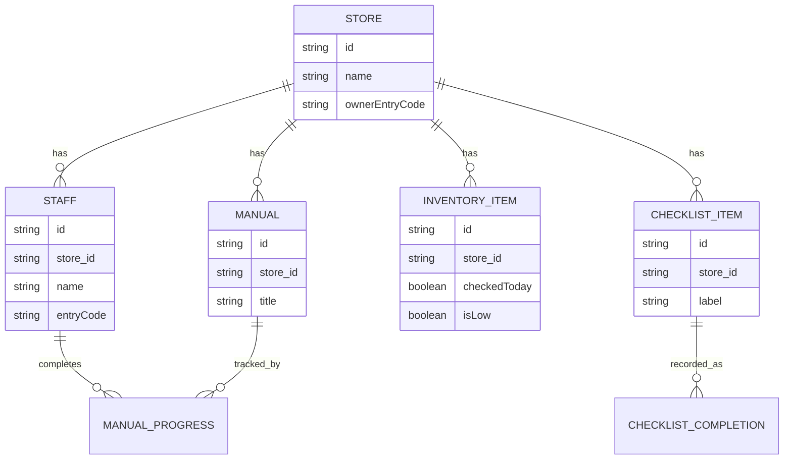

# TongssApp/docs/05_DATA — 데이터 정의

> **문서 소유권:** 최종 수정 권한은 **Store PO(아론)**.
> 👤 아론님이 읽어야 할 것: "어떤 정보가 있고, 어느 화면에서 쓰이는지"만 알면 충분합니다.
> 🤖 Claude Code 참고: 실제 필드 이름과 코드 형태.
> ⚠️ 이 문서는 TongssApp **내부**에서 다루는 데이터 전체를 정의합니다. 이 중 org로 전송되는 필드(집계값)만 뽑은 것이 `../../docs/04_DATA_CONTRACT.md`(shared)입니다. **두 문서는 다른 문서입니다 — 헷갈리지 마세요.**
> - `05_DATA.md` (여기, TongssApp 전용) = TongssApp이 다루는 **모든** 데이터
> - `04_DATA_CONTRACT.md` (shared) = 그중 org로 **나가는** 필드만 (부분집합)

---

## 👤 데이터 종류 — 어느 화면에서 쓰이나

| 데이터 | 쉽게 말하면 | 어느 화면에서 쓰이나 |
|---|---|---|
| Store | 매장 정보 + 사장 Entry Code | 앱 진입(§0), 사장 화면 전체 |
| Manual | 매뉴얼 | 매뉴얼 등록·목록(사장), 매뉴얼 뷰어(직원) |
| ChecklistItem / Completion | 체크리스트 항목 / 완료 기록 | 체크리스트 설정(사장), 체크리스트 실행(직원) |
| InventoryItem | 재고 확인 항목 | 재고 확인 항목 설정(사장), 재고 확인(직원) — ⚠️ **수량이 아니라 "확인했는지"를 기록** |
| Staff / ManualProgress | 직원 + 직원 Entry Code / 학습 기록 | 앱 진입(§0), 직원 현황(사장) |

> ⚠️ 매장·직원은 **회원가입으로 생기지 않습니다.** 팀이 미리 시드 데이터로 준비해둡니다 (`../../examples/MASHITA_BURGER.md` 참조). 앱에서 하는 일은 Entry Code로 이미 있는 레코드를 **조회**하는 것뿐입니다.

---

## 🤖 각 데이터의 실제 형태

### 0. Entry Code 조회 (로그인 대체)

Entry Code는 별도 Object가 아니라, **Store와 Staff 레코드에 이미 들어있는 필드**로 조회합니다.

```javascript
// 입력값 정규화
const code = userInput.trim().toUpperCase();  // "s01o" → "S01O"

// Store에서 사장 코드로 먼저 찾고, 없으면 Staff에서 직원 코드로 찾는다
const store = stores.find(s => s.ownerEntryCode === code);
if (store) {
  // 사장 → pages/owner/dashboard.html로 이동
} else {
  const staff = allStaff.find(s => s.entryCode === code);
  if (staff) {
    // 직원 → pages/staff/today.html로 이동 (staff.store_id로 매장 식별)
  } else {
    // 못 찾음 → 에러 메시지
  }
}
```

### 1. Store (매장)

```javascript
{
  id: "store_001",              // 고유 ID — shared 04_DATA_CONTRACT의 store_id와 동일
  name: "이대표 카페",
  storeNumber: "01",            // Entry Code의 매장번호 부분
  ownerEntryCode: "S01O",       // 사장 진입 코드 — S + storeNumber + O
  createdAt: "2026-08-03T09:00:00+09:00"
}
```

### 2. Manual (매뉴얼)

```javascript
{
  id: "manual_001",
  store_id: "store_001",
  title: "냉장고 청소법",
  photos: ["/uploads/manual_001_1.jpg"],
  content: "월 1회, 문 안쪽까지 닦기",  // 선택
  updatedAt: "2026-08-10T09:00:00+09:00"
}
```
`store_id` 참조로 매장 소속을 표시 (엑셀 VLOOKUP과 같은 개념). `manual_count`, `last_manual_updated_at`은 이 데이터에서 파생되어 org로 전송된다 (04_DATA_CONTRACT §3 — Manual Count, Last Content Update).

### 3. ChecklistItem / ChecklistCompletion

```javascript
// ChecklistItem — 사장이 설정한 항목 (템플릿)
{
  id: "check_001",
  store_id: "store_001",
  label: "냉장고 잠금 확인",
  type: "closing"  // "opening" | "closing"
}

// ChecklistCompletion — 직원이 체크한 기록 (날짜별)
{
  id: "completion_001",
  store_id: "store_001",
  checklist_item_id: "check_001",
  date: "2026-08-10",
  completed: true,
  completed_by: "staff_001"  // Entry Code로 이미 식별된 직원 (staff.entryCode 참조)
}
```
`checklist_completion_rate`(해당 날짜의 완료 항목 수 / 전체 항목 수)가 org로 전송된다 (04_DATA_CONTRACT §3 — Checklist Completion Rate). `completed_by`는 `weekly_active_staff` 계산에도 쓰인다.

### 4. InventoryItem (재고 확인 항목)

> ⚠️ **수량 계산이 아니라 "확인 여부" 기록입니다.** 재고 수량 관리는 토스플레이스가 이미 제공하는 기능이라 Tongss가 다시 만들지 않습니다 (`../../docs/00_PRODUCT_GUIDE.md` §2, §5). 직원이 "오늘 이 품목을 확인했는지", "부족하다고 느꼈는지"만 기록합니다.

```javascript
{
  id: "inv_001",
  store_id: "store_001",
  name: "콜라시럽",
  checkedToday: true,      // 오늘 직원이 확인했는지
  isLow: true,             // 직원이 "부족해요"로 표시했는지
  checkedAt: "2026-08-10T18:00:00+09:00"
}
```
⚠️ `isLow: true` 여부는 org로 전송되지 않는다 — 사장 홈 대시보드(TongssApp 안)에서만 보인다. 박세일즈가 이 숫자로 할 수 있는 일이 없어서 Sales Summary Contract에서 제외됐다 (`../../docs/04_DATA_CONTRACT.md` "이 계약에서 뺀 것" 참조).

### 5. Staff / ManualProgress

```javascript
// Staff
{
  id: "staff_001",
  store_id: "store_001",
  name: "김스태프",
  entryCode: "S01E01"   // 직원 진입 코드 — S + storeNumber + E + 직원번호
}

// ManualProgress — 직원별 "다 봤어요" 기록
{
  staff_id: "staff_001",
  manual_id: "manual_001",
  completedAt: "2026-08-10T15:00:00+09:00"
}
```
`manual_completion_rate`(전체 직원 × 전체 매뉴얼 대비 완료 비율)가 org로 전송된다 (04_DATA_CONTRACT §3 — Manual Completion Rate). `completedAt`은 `last_activity_at`, `weekly_active_staff` 계산에도 쓰인다.

---

## 🤖 데이터 관계도



---

## 👤 TongssApp → TongssOrg로 나가는 필드 (요약)

| TongssApp 데이터 | org로 나가는 파생 필드 |
|---|---|
| Staff 전체 | `staff_count` |
| Manual 전체 | `manual_count`, `last_manual_updated_at` |
| ManualProgress 전체 | `manual_completion_rate` |
| ChecklistCompletion (당일) | `checklist_completion_rate` |
| ManualProgress + ChecklistCompletion + InventoryItem 중 가장 최근 시각 | `last_activity_at` |
| 위 세 활동 중 최근 7일 내 기록이 있는 고유 `staff_id` 수 | `weekly_active_staff` (선택) |

상세는 shared `../../docs/04_DATA_CONTRACT.md`. **계약과 다른 필드를 여기서 임의로 추가/변경하지 마세요.** 변경이 필요하면 shared `04_DATA_CONTRACT.md`를 먼저 고치고 `../../docs/07_DECISIONS.md`에 기록.

---

## 🤖 코딩할 때 (참고용, 아론님은 안 읽어도 됩니다)

```javascript
// assets/js/features/staff/manual-viewer.js
import { loadJSON, saveJSON } from '../../shared/data.js';

const manuals = await loadJSON('/data/manuals.json');
const manual = manuals.find(m => m.id === manualId);

// ✅ 이렇게: ID로 참조
const progress = { staff_id: currentStaffId, manual_id: manual.id, completedAt: new Date().toISOString() };

// ❌ 이렇게 하지 않기: 매뉴얼 제목을 Progress에 통째로 복사
```
