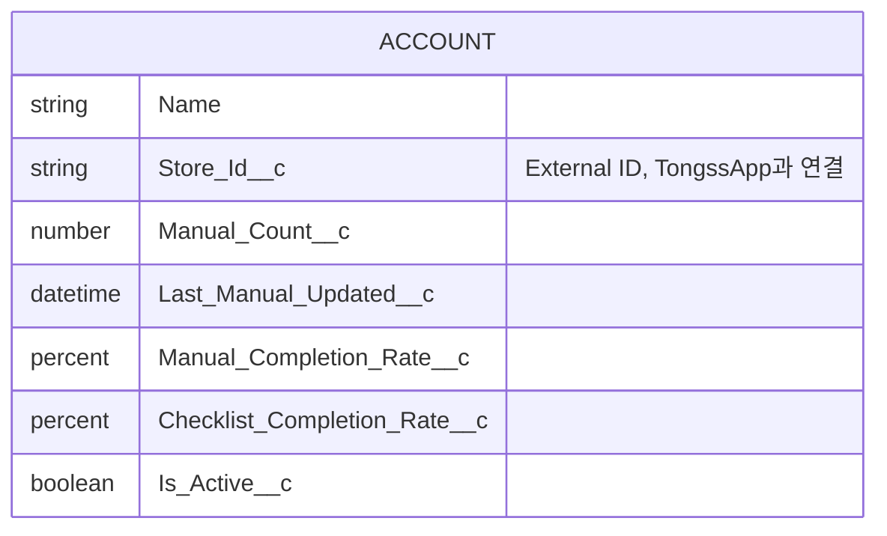

# TongssOrg/docs/03_RELATIONSHIP — Object 관계도

> **문서 소유권:** 최종 수정 권한은 **Org PO(은영)**.
> 👤 Org PO가 읽어야 할 것: 이 문서 전체 — 관계가 단순한 이유.
> 🤖 Claude Code 참고: 아래 ERD 밖의 관계(자식 Object 등)를 임의로 만들지 않기.

---

## 👤 관계도 (ERD)

**Account 하나뿐입니다.** 자식 Object가 없어서 관계선이 없습니다.

---

## 👤 왜 이렇게 단순한가

이전 프로젝트(Pepper's Oven)는 Order__c, Inventory_Consumption__c 같은 "로그성" 자식 Object가 있었습니다. Tongss org는 그런 게 없습니다 — 이유는 `01_OBJECT_MODEL.md`에서 설명한 것과 같습니다: **이 org는 기록을 남기는 시스템이 아니라 TongssApp의 상태를 비추는 거울**이기 때문입니다 (`../../docs/00_PRODUCT_GUIDE.md` §4 참조).

## 👤 앞으로 관계가 늘어날 수 있는 경우

`[확인필요]` 나중에 매장별 방문 이력이나 영업 대응 로그가 필요해지면, 그때 `Store_Activity_Log__c` 같은 자식 Object를 추가하고 Account와 Master-Detail 또는 Lookup 관계를 맺을 수 있습니다 — 이번 스코프는 아닙니다 (`../../docs/00_PRODUCT_GUIDE.md` §5 "우리가 하지 않는 것").

## 👀 PM 확인 사항

관계 구조가 바뀌는 결정(자식 Object 추가 등)은 트랙을 넘는 결정이므로 `../../docs/07_DECISIONS.md`에 기록되어야 합니다.
