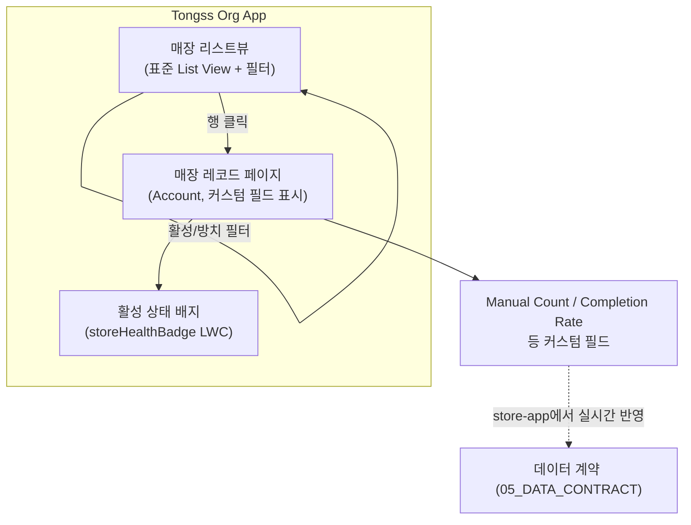
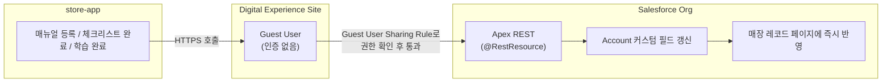

# 🗺️ toss-org/docs/03_USER_FLOW — 사용자 흐름

> **문서 소유권:** 최종 수정 권한은 **Org PO**. 아래는 PM이 제시하는 초안.
> 만든 순서 그대로 정리: **① Salesforce org 내부(박세일즈 화면) → ② store-app에서 오는 데이터 연결**
> 공유 `../../docs/03_USER_FLOW.md`(전체 여정)의 4단계(박세일즈), 5단계(박오너)를 화면 단위로 상세화한 것.

---

## 1️⃣ Salesforce org 내부 흐름 (박세일즈 화면)



### 매장 리스트뷰 — 박세일즈용 (표준 List View)

- **화면에 있는 것**: Account 리스트뷰, "활성"/"방치" 필터, 정렬(마지막 매뉴얼 업데이트일 기준)
- **할 수 있는 것**: 필터를 눌러 방치 매장만 골라보기 → 행 클릭 시 레코드 페이지 이동
- **표준 화면으로 되나, 커스텀이 필요한가?**: **표준 List View로 충분.** 커스텀 LWC 불필요 — 02_PRD 스코프상 복잡한 조건부 로직이 없다.

### 매장 레코드 페이지 — 박세일즈용

- **화면에 있는 것**: 매장 기본 정보(Account 표준 필드) + 커스텀 필드(매뉴얼 수, 마지막 업데이트일, 매뉴얼 학습 완료율, 체크리스트 완료율, 활성 상태 배지)
- **할 수 있는 것**: 한 화면에서 이 매장이 "잘 쓰고 있는지" 바로 판단
- **표준 화면으로 되나, 커스텀이 필요한가?**: 필드 배치는 **표준 Lightning Record Page(App Builder, 클릭 배치)**로 충분. 활성 상태를 색깔 배지로 강조하고 싶다면 `storeHealthBadge`(Level 2, 공용) 커스텀 LWC 하나만 추가 — Base Component(`lightning-badge`)로 안 되는 조건부 색상 표시이기 때문.

---

## 2️⃣ store-app에서 오는 데이터 연결

store-app의 활동(매뉴얼 등록, 체크리스트 완료, 학습 완료)이 실시간으로 이 매장 레코드에 반영되는 구간. Pepper's Oven 때 만들었던 "외부 키오스크 → Guest User → Apex REST" 구조와 방향만 다르고 패턴은 동일하다 (그때는 손님이 주문을 org로 밀어넣었고, 지금은 store-app이 매장 활동 데이터를 org로 밀어넣는다).



- **연결 방식**: store-app에서 활동 발생 → Digital Experience의 Guest User 권한으로 → Apex REST(`StoreRestService`)를 호출 → 해당 `store_id`와 매핑된 Account 레코드의 커스텀 필드 갱신
- **인증 없음**: store-app은 로그인하지 않음, 대신 Guest User Sharing Rule로 딱 필요한 데이터(Account, 특정 필드만)만 접근 허용
- **연결 확인 지점**: store-app에서 매뉴얼을 등록하면 → 박세일즈의 매장 레코드 페이지에서 `Manual_Count__c`가 즉시 올라가야 정상 (04_ROADMAP Week 1 Hello World 스파이크가 바로 이 경로를 확인하는 것)
- **필드 매핑**: `../../docs/05_DATA_CONTRACT.md`(shared)가 유일한 진실

---

## 3️⃣ 박오너(의사결정자) 관점

박오너는 별도 화면이 없다(02_PRD §1 — Nice-to-have). 박세일즈의 매장 리스트뷰에서 "활성 매장 비율" 같은 숫자를 리포트로 뽑아 보는 정도. 이번 스코프의 커스텀 개발 대상이 아니다.

---

## 🚨 이번엔 만들지 않을 것

```
❌ 매장별 매뉴얼 상세 콘텐츠를 org 안에 저장/열람 (집계 필드만 받는다 — 05_DATA_CONTRACT 참조)
❌ 박오너 전용 대시보드
❌ 매장 간 비교 리포트 (Nice-to-have)
```

---

## 리뷰 세션 안건
1. 활성 상태 배지(`storeHealthBadge`)를 만들지, 필드 색상 포맷팅(조건부 서식)으로 충분한지 — Org PO 결정
2. 리스트뷰 필터 기준(방치 매장 판정 로직)을 Flow로 자동 계산할지, store-app이 `is_active`를 직접 보낼지 — 05_DATA.md §자동화 참조