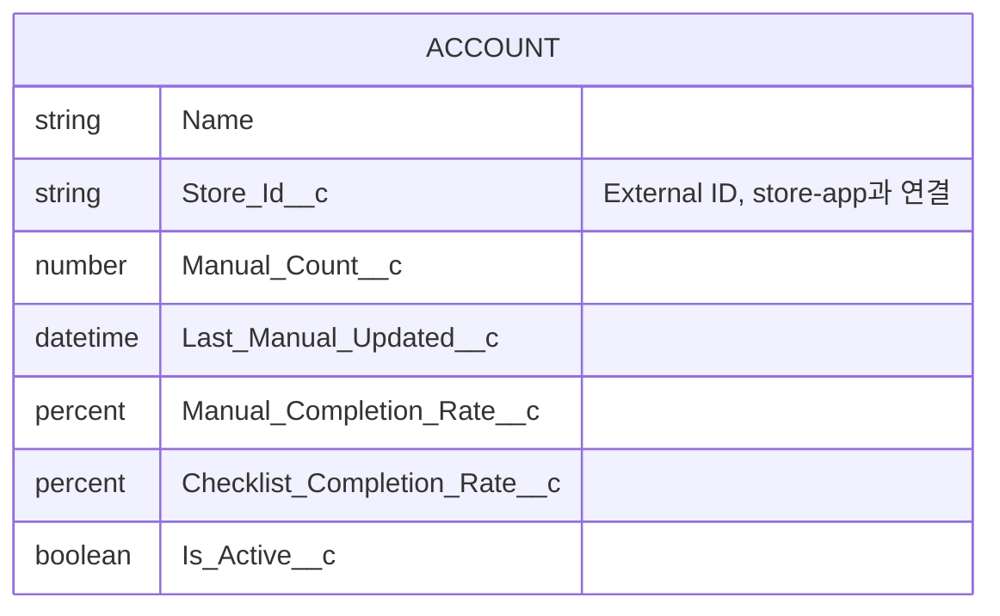

# 🏪 toss-org/docs/05_DATA — Data Model

> **문서 소유권:** 최종 수정 권한은 **Org PO(은영)**. 아래는 PM이 제시하는 초안 — 설계 판단의 형식은 이전 프로젝트(Pepper's Oven) 방식을 그대로 채택, 실제 스키마는 Tongss 도메인으로 교체.
> ⚠️ 이 문서는 org 내부 스키마 전체를 정의한다. store-app에서 넘어오는 필드의 유일한 진실은 `../../docs/05_DATA_CONTRACT.md`(shared)다 — **다른 문서다, 헷갈리지 말 것.**

---

## 책임 분담 (Org PO ↔ Platform Lead)

org의 데이터 모델은 **설계와 세팅을 분리하지 않는다.** 두 사람이 같이 앉아서 정하고 그 자리에서 만든다. 다만 최종 책임은 아래처럼 나눈다.

| 작업 | Org PO (은영) | Platform Lead (혜준, Admin) |
|---|:---:|:---:|
| 비즈니스 요구 분석 | ✅ | |
| Object 설계 | ✅ 책임 | 🤝 의견 |
| Field 설계 | ✅ 책임 | 🤝 구현 관점 검토 |
| Relationship 설계 | ✅ 책임 | 🤝 |
| Record Type 필요 여부 판단 | ✅ 책임 | 🤝 구현 |
| Validation Rule | 🤝 | ✅ 책임 |
| Page Layout | | ✅ 책임 |
| Permission Set | | ✅ 책임 |
| Profile / Sharing | | ✅ 책임 |
| Flow | 🤝 | ✅ 책임 |
| Org 설정 | | ✅ 책임 |

**✅ 책임** = 결정권과 문서 기록 책임 / **🤝** = 함께 논의·검토, 결정은 책임자가

- 이 문서(05_DATA.md)의 기록 책임은 **은영(Org PO)** — Object/Field/Relationship/Record Type 설계 근거를 여기 남긴다.
- 권한·레이아웃·Flow 관련 기록 책임은 **혜준(Platform Lead)** — `platform-lead/docs/PERMISSIONS.md`에 남긴다.
- 승우(Integration Lead)는 이 작업에 참여해 org 내부 구조를 파악하지만 오너십은 없다 (학습·통합 준비 목적).

> 💡 **왜 분리하지 않는가:** Record Type을 만들면 Page Layout을 지정해야 하고, Page Layout이 정해지면 Profile/Permission Set에 할당해야 사용자가 실제로 볼 수 있다. 설계자와 세팅자가 따로 움직이면 이 연결고리에서 반드시 막힌다.

---

## 0. 설계 판단 요약

| 결정 | 이유 |
|---|---|
| Store는 **표준 Account** (Record Type 불필요, 이번엔 거래상대 종류가 하나뿐) | 조직/거래상대 데이터는 Account 우선 검토 원칙 (Pepper's Oven 때와 동일 원칙). `[확인필요]` **Record Type 여부는 은영 책임 판단** — 만들기로 하면 Page Layout·Profile 할당이 따라오므로 혜준과 함께 결정 |
| 매뉴얼/체크리스트 **원본 데이터는 org에 저장하지 않음** — 집계 필드만 Account에 | 02_PRD 스코프상 org는 "상태 확인"만 하면 됨. 원본을 다 옮기면 데이터 계약이 비대해지고 store-app과 이중 관리됨 |
| `Is_Active__c`는 **Flow로 자동 계산** (Apex 트리거 아님) `[확인필요]` | 단순 날짜 비교 로직이라 트리거보다 Flow가 유지보수 쉬움 — Org PO·Integration Lead·Platform Lead가 Flow vs Apex 세션에서 최종 결정 (04_ROADMAP Week 1) |
| Custom Object **추가하지 않음** (이번 스코프에선) | Order__c/Inventory_Item__c 같은 별도 오브젝트가 필요했던 Pepper's Oven과 달리, Tongss org 쪽은 Account 필드 확장만으로 02_PRD 스코프를 충족 |

---

## 1. 최종 스키마 (초안)

### 1-1. Account — Store (Record Type 없음, 표준 Account 그대로 확장)

| 필드명 | API Name | 타입 | 설명 |
|---|---|---|---|
| Account Name | `Name` | Text | 매장명 |
| Store ID | `Store_Id__c` | Text (External ID) | store-app의 `store_id`와 매핑되는 키 — **05_DATA_CONTRACT §2 참조, 유일한 연결고리** |
| Manual Count | `Manual_Count__c` | Number(18,0) | 등록된 매뉴얼 총 개수 |
| Last Manual Updated | `Last_Manual_Updated__c` | DateTime | 마지막 매뉴얼 등록/수정 시각 |
| Manual Completion Rate | `Manual_Completion_Rate__c` | Percent(3,0) | 직원 전체 매뉴얼 학습 완료율 |
| Checklist Completion Rate | `Checklist_Completion_Rate__c` | Percent(3,0) | 오늘 체크리스트 완료율 |
| Is Active | `Is_Active__c` | Checkbox (Formula 또는 Flow가 채움) `[확인필요]` | 방치 매장 판별용 |

**Related List**: 없음 (원본 데이터는 org에 저장하지 않으므로 자식 오브젝트 없음)

---

## 2. 관계도 (ERD)



Pepper's Oven 때보다 훨씬 단순하다 — 자식 오브젝트(Order__c, Inventory_Consumption__c 같은 로그성 데이터)가 없다. 이유: 이번 프로젝트의 org는 "기록을 남기는 시스템"이 아니라 "store-app의 상태를 비추는 거울"이기 때문 (02_PRD §1 참조).

`[확인필요]` 나중에 매장별 방문 이력/영업 대응 로그가 필요해지면 그때 자식 오브젝트(예: `Store_Activity_Log__c`)를 추가 — 이번 스코프는 아님 (00_WHY §6 "우리가 하지 않는 것").

---

## 3. 자동화 (Flow + Apex) — 초안, Week 1 세션에서 확정

### 3-1. 필드 갱신 경로: Apex REST가 직접 갱신 (제안)
- store-app에서 활동 발생 → `StoreRestService`(Apex REST) 호출 → `Manual_Count__c`, `Last_Manual_Updated__c`, `Manual_Completion_Rate__c`, `Checklist_Completion_Rate__c`를 **직접 update**
- 트리거 불필요 (REST가 이미 서버 로직이므로)

### 3-2. `Is_Active__c` 계산 — Flow 후보 (제안, `[확인필요]`)
- **Scheduled Flow** (매일 1회): `Last_Manual_Updated__c` 또는 `Checklist_Completion_Rate__c`가 N일 이상 갱신 안 됐으면 `Is_Active__c = false`
- 대안: store-app이 `is_active`를 직접 계산해서 보내는 방식(05_DATA_CONTRACT §3-5) — Flow보다 단순하지만 로직이 store-app에 종속됨
- **Org PO·Integration Lead·Platform Lead가 결정 후 06_ARCHITECTURE.md와 08_DECISIONS.md(shared)에 기록**

### 3-3. Apex Classes (초안)
| 클래스 | 역할 |
|---|---|
| `StoreRestService.cls` | store-app 전용 REST 진입점 (`@RestResource`) — Manual/Checklist 집계 필드 갱신 |
| `StoreRestServiceTest.cls` | 테스트 클래스 (커버리지 75% 이상 필수 — 06_ARCHITECTURE.md 참조) |

Pepper's Oven의 `OrderRestService` 패턴을 그대로 재활용 (04_ROADMAP Week 1 Hello World 스파이크에서 확인).

---

## 4. LWC 컴포넌트 (04_COMPONENT_MAP.md 요약)

| 컴포넌트 | 배치 위치 | 역할 |
|---|---|---|
| `storeHealthBadge` (필요 시) | 매장 레코드 페이지 | Is_Active__c를 조건부 색상 배지로 표시 |

---

## 5. Tab / App 구성 (초안)

```
Tongss Org App
├── Stores       (Account 리스트뷰 — 매장 목록, 활성/방치 필터)
└── Store Detail (Account 레코드 페이지 — 매장 상세, 커스텀 필드 + 배지)
```

Pepper's Oven보다 탭 구성도 단순하다 (New Order, Order Queue, Inventory 같은 운영 탭이 없음 — org는 조회 전용이기 때문).