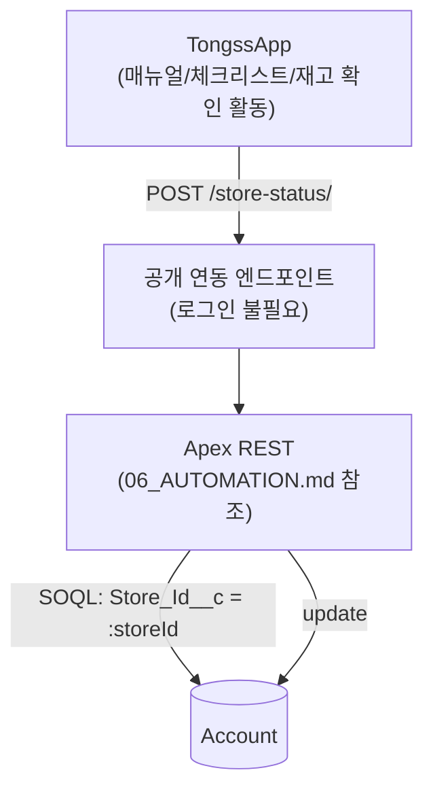

# TongssOrg/docs/05_PERMISSION — 권한 (누가 뭘 볼 수 있는가)

> **문서 소유권:** 최종 수정 권한은 **Platform Lead(혜준)**, Org PO(은영)·Integration Lead(승우)와 협의.
> 👨‍💻 Salesforce Developer(혜준)가 읽어야 할 것: 이 문서 전체 — 권한 구성 책임자입니다.
> 👀 PM·Integration Lead 참고: TongssApp이 org에 데이터를 보내는 통로가 여기 정의됩니다.
> ⚠️ **MVP에서 인증(로그인)은 의도적으로 미룹니다.** TongssApp 사용자(사장·직원)가 앱에 들어가는 방식은 **Entry Code**이고, 이건 TongssApp 자체 로직입니다 — Salesforce와는 무관합니다 (`TongssApp/docs/03_USER_FLOW.md` §0 참조). 이 문서는 그와 별개로, "TongssApp이 org로 데이터를 보낼 때 쓰는 통로"만 다룹니다.
> 자세한 권한 세트 값 자체는 `../../platform-lead/docs/PERMISSIONS.md`에 기록합니다.

---

## 👤 이 문서가 다루는 것

**Salesforce는 MVP에서 인증을 책임지지 않습니다.** Salesforce는 운영 데이터(매장 정보, 직원 정보, 매뉴얼/체크리스트 완료율 등)를 저장하는 백엔드일 뿐입니다. 여기서 다룰 건 두 가지뿐입니다.

| | 무엇인가 | 로그인이 필요한가 |
|---|---|---|
| 박세일즈 (내부 직원) | 실제 Salesforce 사용자, org 화면을 직접 봄 | 예 — 표준 Profile/Permission Set |
| TongssApp → TongssOrg 연동 | 사람이 아니라 **시스템이 데이터를 보내는 통신** | 아니오 — 공개 연동 엔드포인트 |

---

## 👤 박세일즈 권한

표준 Salesforce Profile + Permission Set. Account 조회 권한만 있으면 충분합니다 (이번 스코프는 리스트뷰·레코드 페이지 조회 중심).

---

## 👤 TongssApp → Org 연동 권한 — 최소 원칙

TongssApp은 Salesforce 계정이 없는 외부 시스템입니다. 사람이 로그인하는 게 아니라 **서버 간 데이터 전송**이므로, 계약(`../../docs/04_DATA_CONTRACT.md`)에 정의된 필드만 딱 그만큼 쓸 수 있게 최소로 열어둡니다.

| 항목 | 허용 범위 |
|---|---|
| Object 접근 | Account만 |
| 필드 접근 | `Manual_Count__c` 등 계약에 정의된 필드만, **Edit 권한만** |
| 금지 | Delete, 계약 외 필드 접근, 다른 Object 접근 |

**"일단 넓게 열고 나중에 좁히기"는 하지 않습니다.** 처음부터 계약에 필요한 최소 범위만 엽니다. 범위를 넓혀야 할 필요가 생기면 Integration Lead·Org PO와 합의 후 `../../platform-lead/docs/PERMISSIONS.md`에 변경 이력을 남깁니다.

---

## 👤 연결 구조



- **Entry Code(사람이 앱에 들어가는 방식)와 이 엔드포인트(시스템 간 통신)는 완전히 별개입니다.** 헷갈리지 마세요.
- 브라우저에서 실제 호출이 되려면 Setup의 **CORS Allowed Origins**에 TongssApp 배포 도메인을 반드시 등록해야 합니다 (`../../docs/03_PROJECT_GUIDE.md` Week 1 Hello World 스파이크 체크리스트).

---

## 👨‍💻 실제로 설정하는 곳 (Salesforce Developer)

"로그인 없이 호출 가능한 공개 엔드포인트"를 Salesforce에서 여는 구체적인 방법은 **구현 시점에 Platform Lead가 정합니다.** 이 문서가 못 박는 건 방법이 아니라 원칙입니다: **계약에 정의된 필드만, Edit 권한만, 최소로.**

```
🤖 force-app/main/default/permissionsets/   ← 외부 연동용 최소 권한 세트
```
- Setup → CORS → Allowed Origins List

## 👀 PM 확인 사항

이 연동 통로의 권한 범위가 `../../docs/04_DATA_CONTRACT.md`의 필드 범위를 벗어나지 않는지 확인하세요. 벗어나면 보안 문제가 됩니다.
