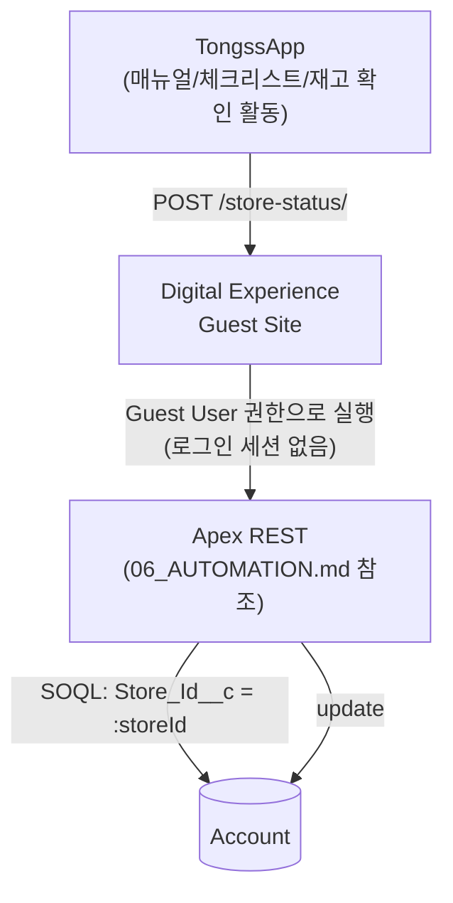

# TongssOrg/docs/05_PERMISSION — 권한 (누가 뭘 볼 수 있는가)

> **문서 소유권:** 최종 수정 권한은 **Platform Lead(혜준)**, Org PO(은영)·Integration Lead(승우)와 협의.
> 👨‍💻 Salesforce Developer(혜준)가 읽어야 할 것: 이 문서 전체 — 권한 세트 구성 책임자입니다.
> 👀 PM·Integration Lead 참고: TongssApp이 org에 접근하는 방식이 여기 정의됩니다.
> 자세한 권한 세트 값 자체는 `../../platform-lead/docs/PERMISSIONS.md`에 기록합니다 — 이 문서는 "왜 이런 권한 구조인지"를 설명합니다.

---

## 👤 두 종류의 사용자, 완전히 다른 권한 체계

| 사용자 | 접근 방식 | 권한 체계 |
|---|---|---|
| 박세일즈 (내부 직원) | 실제 Salesforce 로그인 | 표준 Profile / Permission Set |
| TongssApp (사장·직원) | 로그인 없음, 익명 호출 | **Digital Experience Guest Site + Guest User 프로필** |

TongssApp은 사장·직원이 Salesforce 계정 없이 쓰는 사이트이므로, 내부 직원과 똑같은 권한 체계를 쓸 수 없습니다. 그래서 **Guest User**라는, 로그인하지 않은 상태에서도 딱 필요한 만큼만 데이터를 만지게 해주는 별도 통로를 씁니다.

---

## 👤 Guest User 권한 — 최소 원칙

**"일단 넓게 열고 나중에 좁히기"는 하지 않습니다.** 처음부터 계약(`../../docs/04_DATA_CONTRACT.md`)에 필요한 최소 범위만 엽니다.

| 항목 | 허용 범위 |
|---|---|
| Object 접근 | Account만 |
| 권한 종류 | **Edit(해당 커스텀 필드만)** — `Manual_Count__c`, `Last_Manual_Updated__c`, `Manual_Completion_Rate__c`, `Checklist_Completion_Rate__c` |
| 금지 | Delete, 위 4개 외 다른 필드 접근, 다른 Object 접근 |

범위를 넓혀야 할 필요가 생기면 Integration Lead·Org PO와 합의 후 `../../platform-lead/docs/PERMISSIONS.md`에 변경 이력을 남깁니다.

---

## 👤 외부(TongssApp) 연결 구조



- TongssApp은 로그인하지 않습니다. 대신 Guest User Sharing Rule로 딱 필요한 데이터(Account, 특정 필드만)만 접근을 허용합니다.
- 브라우저에서 실제 호출이 되려면 Setup의 **CORS Allowed Origins**에 TongssApp 배포 도메인을 반드시 등록해야 합니다 (`../../docs/03_PROJECT_GUIDE.md` Week 1 Hello World 스파이크 체크리스트).

---

## 👨‍💻 실제로 설정하는 곳 (Setup)

```
🤖 force-app/main/default/permissionsets/   ← Guest User 포함 권한 세트
```
- Setup → Digital Experiences → Guest User Profile
- Setup → CORS → Allowed Origins List

## 👀 PM 확인 사항

Guest User 권한 범위가 `../../docs/04_DATA_CONTRACT.md`의 필드 범위를 벗어나지 않는지 확인하세요. 벗어나면 보안 문제가 됩니다.
