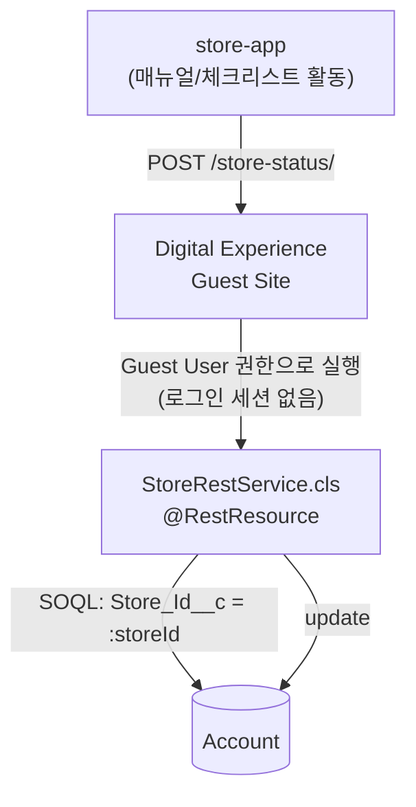

# 🏗️ toss-org/docs/06_ARCHITECTURE — 아키텍처

> **문서 소유권:** 최종 수정 권한은 **Org PO**. 아래는 이전 프로젝트(Pepper's Oven) 구조를 그대로 채택하고, Tongss 스코프에 맞게 불필요한 부분(자식 오브젝트, 다수 LWC)을 덜어낸 초안.

## 한 문장 규칙

> **화면은 `lwc/`, 서버 로직은 `classes/`, 데이터 구조는 `objects/`(Account 필드 확장뿐), 자동화는 Flow(코드 아님), 문서는 `docs/`.**

---

## 🗂️ 폴더 구조 (초안)

```
force-app/main/default/
├── lwc/
│   └── storeHealthBadge/       ← [확인필요] 만들지 여부 결정 후 생성 (03_USER_FLOW 참조)
│
├── classes/
│   ├── StoreRestService.cls        ← store-app 전용 REST 진입점
│   └── StoreRestServiceTest.cls
│
├── objects/
│   └── Account/fields/              ← 커스텀 필드만 (Store_Id__c, Manual_Count__c 등). Setup에서 만들면 자동 생성됨
│
├── triggers/                        ← 이번 스코프는 비어있을 가능성 높음 (필드 갱신은 REST가 직접 처리)
│
├── flows/                           ← Is_Active__c 계산용 Scheduled Flow (Flow Builder로 만들면 자동 생성)
├── flexipages/                      ← 매장 레코드 페이지 배치 (App Builder)
├── permissionsets/                  ← Guest User 포함 권한 세트
├── applications/                    ← Tongss Org App 정의
├── tabs/                            ← Stores 탭 정의
│
docs/
CLAUDE.md
```

---

## 🌐 외부 통합 아키텍처 (store-app ↔ Salesforce)

`store-app`은 순수 HTML/CSS/JS(또는 React)로 만든 사장·직원용 사이트다. Salesforce 로그인 없이 접근해야 하니, 일반 로그인 세션이 필요한 내부 화면과는 완전히 다른 통로로 org에 연결된다. Pepper's Oven 때의 손님용 키오스크 연동과 패턴이 완전히 동일하다 — 그때는 "주문 생성"이었고 지금은 "매장 상태 갱신"이다.



**내부 org 아키텍처와의 분리**: 내부 화면(매장 리스트뷰, 레코드 페이지)은 실제 Salesforce 계정으로 로그인한 박세일즈만 쓸 수 있고, 표준 권한 체계를 따른다. 반면 store-app은 로그인 세션이 없는 익명 호출이기 때문에 **Digital Experience Guest Site + Guest User 프로필**이라는 별도 권한 체계로만 동작한다 — Guest User Profile에는 `Account` 객체의 **Edit 권한(해당 커스텀 필드만)**만 최소로 부여하고, Delete·다른 필드 접근은 금지한다. 브라우저에서 실제 호출이 되려면 Setup의 CORS Allowed Origins에 store-app 배포 도메인을 반드시 등록해야 한다 (04_ROADMAP Week 1 Hello World 스파이크 체크리스트).

---

## 📋 핵심 규칙 (Pepper's Oven 원칙 그대로 채택 — 스택 규칙이라 도메인 무관)

### 1️⃣ 컴포넌트 하나 = lwc 폴더 하나
### 2️⃣ 공용 LWC는 이름에 `shared` 접두어 (3곳 이상 재사용 기준)
### 3️⃣ Apex 클래스는 역할별로 분리 (한 클래스 = 한 가지 일)
### 4️⃣ 트리거는 Object당 1개, 로직은 Handler 클래스로 — 이번 스코프는 트리거 자체가 없을 가능성이 높음
### 5️⃣ 테스트 클래스 없이 배포 금지 (코드 커버리지 75% 이상)
### 6️⃣ 헷갈리면 새로 만들지 말고 팀에 물어보기 (한 org를 공유하기 때문)
### 7️⃣ 외부(비-Salesforce) 클라이언트는 `*RestService.cls`로 별도 진입점

```
✅ 실제 적용: StoreRestService.cls (@RestResource)
   → LWC용 컨트롤러가 따로 없다면(현재 스코프엔 조회용 Apex Controller 불필요, 표준 화면 사용)
     REST 클래스가 검증 로직까지 직접 갖는다
```

---

## 🔍 자주 헷갈리는 포인트

```
Q. objects/ 폴더에 직접 파일을 만드나요?
A. 아니요. Setup 화면에서 필드를 클릭으로 만들면 sf project retrieve start로 받아와 자동 채워집니다.

Q. Flow는 어디 폴더에 있나요?
A. flows/ 폴더, Flow Builder(화면 클릭 방식)로 만드는 게 기본입니다.

Q. Is_Active__c를 Flow로 할지 Apex로 할지 아직 안 정했는데요?
A. 04_ROADMAP Week 1의 "Flow vs Apex 분담 결정" 세션에서 정합니다. 정해지면 이 문서와
   shared 08_DECISIONS.md에 기록.

Q. force-app 바깥의 store-app은 뭔가요?
A. 사장·직원용 사이트로, Digital Experiences Guest Site를 통해 StoreRestService의 REST
   엔드포인트를 인증 없이 호출합니다. force-app 소스와 독립적이며, 자체 규칙은
   store-app/docs/06_ARCHITECTURE.md에서 따로 관리합니다.
```

---

## 직접 만든 API

Custom Apex REST API (`StoreRestService.cls`) — `@RestResource(urlMapping='/tongss/store-status/*')`
- POST: store-app의 활동 데이터를 받아 Account 필드 갱신 (05_DATA_CONTRACT 참조)

## 내부적으로 쓴 Salesforce API

Lightning Platform API — 이번 스코프는 대부분 표준 List View/Record Page라 `@AuraEnabled` Apex Controller가 필요 없을 가능성이 높다. `storeHealthBadge`를 만들기로 하면 그때 `@wire`용 Apex 메서드 추가.