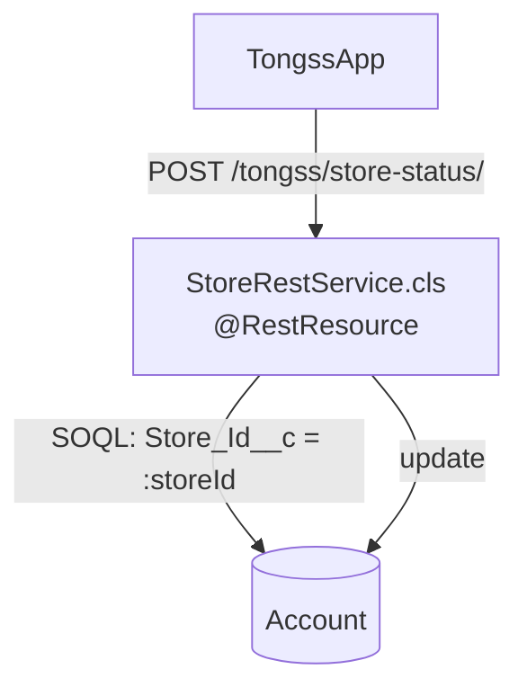

# TongssOrg/docs/06_AUTOMATION — 자동화 구현 (Apex, LWC)

> **문서 소유권:** 최종 수정 권한은 **Org PO(은영) + Platform Lead(혜준)**, 함께 결정.
> 👨‍💻 Salesforce Developer가 읽어야 할 것: 이 문서 전체 — 실제로 손으로 만드는 부분입니다.
> 🤖 Claude Code 참고: Apex 클래스 작성/리뷰 시 아래 규칙과 폴더 위치를 따를 것.
> 👤 Org PO 참고: "왜 이 방식(Flow vs Apex)을 골랐는지"만 알면 충분합니다, 코드 자체는 안 읽어도 됩니다.
> 선언형 자동화(Flow)는 `04_FLOW.md` 참조.

---

## 👤 Flow vs Apex — 언제 뭘 쓰나

| 상황 | 선택 |
|---|---|
| 단순 조건 계산 (예: N일 이상 갱신 안 되면 비활성) | Flow (`04_FLOW.md`) |
| 외부(TongssApp, 로그인 없음)에서 들어오는 요청 처리 | Apex REST (아래) |
| 복잡한 검증·여러 Object에 걸친 로직 | Apex (이번 스코프엔 해당 없음) |

**이번 스코프에서 Apex가 필요한 곳은 딱 하나 — TongssApp의 활동 데이터를 받는 REST 진입점입니다.**

---

## 👤🤖 직접 만든 API — StoreRestService

| 항목 | 내용 |
|---|---|
| 이름 | `StoreRestService.cls` |
| 방식 | `@RestResource(urlMapping='/tongss/store-status/*')` |
| 하는 일 | TongssApp의 활동 데이터를 POST로 받아 Account 커스텀 필드 갱신 (`../../docs/04_DATA_CONTRACT.md` 참조) |
| 인증 | 없음 — 로그인 없이 호출되는 공개 엔드포인트 (`05_PERMISSION.md` 참조) |
| 참고 | 이전 프로젝트(Pepper's Oven)의 `OrderRestService` 패턴을 그대로 재활용 |



## 🤖 Apex 클래스 목록

| 클래스 | 역할 |
|---|---|
| `StoreRestService.cls` | TongssApp 전용 REST 진입점 — Manual/Checklist/Inventory 집계 필드 갱신 |
| `StoreRestServiceTest.cls` | 테스트 클래스 (코드 커버리지 75% 이상 필수) |

```
🤖 force-app/main/default/classes/
├── StoreRestService.cls
└── StoreRestServiceTest.cls

force-app/main/default/triggers/   ← 이번 스코프는 비어있을 가능성 높음 (필드 갱신은 REST가 직접 처리)
```

---

## 👤 화면에 자동으로 표시되는 것 — 활성 상태 배지

`Is_Active__c` 값을 리스트뷰·레코드 페이지에서 색깔 배지로 보여주고 싶을 수 있습니다. 두 가지 방법이 있습니다.

| 방법 | 코드 필요? | 추천 |
|---|---|---|
| 필드 조건부 서식 (Setup에서 클릭) | 아니오 | ⭐ 이걸로 충분하면 이걸 쓴다 |
| 커스텀 LWC (`storeHealthBadge`) | 예 | 조건부 서식으로 안 되는 표현이 필요할 때만 |

`[확인필요]` 어느 쪽으로 할지 — Org PO 결정 사항. **UI 구현은 우선순위가 낮으므로, 클릭 설정으로 되면 코드를 새로 만들지 않습니다.**

<details>
<summary>👨‍💻🤖 펼쳐서 보기 — storeHealthBadge를 실제로 만들기로 하면 (LWC 구현 참고)</summary>

LWC 컴포넌트 하나는 파일 4개 세트입니다:
```
storeHealthBadge/
├─ storeHealthBadge.html         ← 화면 뼈대
├─ storeHealthBadge.js           ← 동작/로직
├─ storeHealthBadge.js-meta.xml  ← 설정 (어디서 쓸 수 있는지)
└─ storeHealthBadge.css          ← 스타일 (선택)
```

```javascript
import { LightningElement, api, wire } from 'lwc';

export default class StoreHealthBadge extends LightningElement {
  @api recordId;               // 레코드 페이지가 넣어주는 값 — 이 매장의 Account Id
  @wire(getStoreStatus) status; // Apex에서 데이터를 자동으로 받아옴
}
```

**만드는 법(VS Code):** `Cmd+Shift+P` → "SFDX: Create Lightning Web Component" → 이름 입력(camelCase) → `force-app/main/default/lwc/`에 자동 생성.

이번 스코프에서 다른 커스텀 LWC는 필요 없을 가능성이 높습니다 — 매장 리스트·상세는 표준 List View/Record Page로 충분합니다(`02_FIELD_GUIDE.md` 참조).

</details>

---

## 👨‍💻🤖 코드 작성 규칙

1. 컴포넌트 하나 = lwc 폴더 하나
2. 공용 LWC는 이름에 `shared` 접두어 (3곳 이상 재사용 기준)
3. Apex 클래스는 역할별로 분리 (한 클래스 = 한 가지 일)
4. 트리거는 Object당 1개, 로직은 Handler 클래스로 — 이번 스코프는 트리거 자체가 없을 가능성이 높음
5. 테스트 클래스 없이 배포 금지 (코드 커버리지 75% 이상)
6. 외부(비-Salesforce) 클라이언트는 `*RestService.cls`로 별도 진입점
7. 헷갈리면 새로 만들지 말고 팀에 물어보기 (한 org를 공유하기 때문)

---

## 🎨 화면 스타일 (참고, 최소화 원칙)

색·간격은 Salesforce 기본 SLDS 값을 그대로 쓰고 하드코딩하지 않습니다. 브랜드 색을 맞추고 싶으면 Setup → Themes and Branding에서 전역으로 설정합니다(코드 불필요). **TongssApp과 브랜드 팔레트를 통일할지는 Org PO가 결정** — 박세일즈는 여러 Salesforce 앱을 넘나드는 사용자라 "브랜드 통일"보다 "Salesforce 표준처럼 보이는 것"이 더 중요할 수 있습니다.

---

## 🔍 자주 헷갈리는 포인트

```
Q. force-app 안 폴더에 직접 파일을 만드나요?
A. 아니요. Setup 화면에서 클릭으로 만들면 `sf project retrieve`로 받아와 자동 채워집니다.

Q. force-app 바깥의 TongssApp은 뭔가요?
A. 사장·직원용 사이트로, 로그인 없이 StoreRestService의 REST 엔드포인트를 호출합니다
   (05_PERMISSION.md 참조). 사람의 앱 진입(Entry Code)과는 무관한, 시스템 간 통신입니다.
   force-app 소스와 독립적이며, 자체 규칙은 TongssApp/CLAUDE.md·docs에서 따로 관리합니다.
```

## 👀 PM 확인 사항

Flow vs Apex 최종 결정, LWC 제작 여부는 트랙을 넘는 결정이므로 `../../docs/07_DECISIONS.md`에 기록되어야 합니다.
