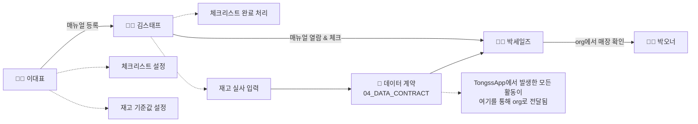

# 02_USER_FLOW — 전체 여정 (공유)

> 오너: Sara
> 두 스택을 가로지르는 흐름만 다룹니다. TongssApp 안의 세부 화면 흐름은 `TongssApp/docs/03_USER_FLOW.md`에서 상세화합니다. TongssOrg는 화면 흐름이 아니라 Object/Field 중심 문서 체계라 대응 문서가 다릅니다 — 외부(TongssApp) 연결 구조는 `TongssOrg/docs/05_PERMISSION.md`, 필드별 화면 표시는 `TongssOrg/docs/02_FIELD_GUIDE.md`에서 상세화합니다.
> 근거: `00_PRODUCT_GUIDE.md` §3 (Demo Day 한 줄), `01_PERSONAS.md`

---

## 전체 여정 (Demo Day 한 줄의 확장판)



---

## 단계별 상세

### 1단계 — 이대표: 초기 설정 (최초 1회성 작업)

| 순서 | 화면 | 행동 |
|---|---|---|
| 1-1 | 로그인/매장 등록 | 최초 가입, 매장 정보 입력 |
| 1-2 | 매뉴얼 등록 | 사진 + 짧은 텍스트로 매뉴얼 작성 (5분 이내 목표) |
| 1-3 | 체크리스트 설정 | 오픈/마감 체크리스트 항목 등록 |
| 1-4 | 재고 기준값 설정 | 품목별 "부족" 기준 수량 입력 |

**분기 처리:** 매뉴얼이 하나도 없는 상태에서 김스태프가 먼저 접속하면 → 빈 상태(Empty State) 문구 필요 (`06_VOICE_AND_TONE.md` 참조)

### 2단계 — 김스태프: 현장 사용 (매 근무일 반복)

| 순서 | 화면 | 행동 |
|---|---|---|
| 2-1 | 진입 | 링크 또는 QR로 즉시 접근 (앱 설치 요구 없음) |
| 2-2 | 매뉴얼 열람 | 상황별로 찾음 — "지금 마감 시간"이면 마감 체크리스트가 먼저 노출 |
| 2-3 | "다 봤어요" 체크 | 학습 완료 표시 (감시 아닌 진행 표시) |
| 2-4 | 체크리스트 완료 처리 | 완료 시점이 이대표 대시보드에 반영 |
| 2-5 | 재고 실사 입력 | 한 손 입력, 기준값 이하면 "부족" 알림 |

### 3단계 — 데이터가 org로 전달됨

2단계에서 생긴 활동(매뉴얼 등록 수, 학습 완료, 체크리스트 완료율, 재고 알림)이 Apex REST 엔드포인트를 통해 TongssOrg로 전달됩니다. 필드 정의는 `04_DATA_CONTRACT.md` 참조.

### 4단계 — 박세일즈: org에서 확인 (필요 시 반복)

| 순서 | 화면 | 행동 |
|---|---|---|
| 4-1 | 매장 리스트뷰 | 활성/방치 매장 필터링 |
| 4-2 | 매장 레코드 페이지 | 등록 매뉴얼 수, 학습 완료율 확인 |

### 5단계 — 박오너: 지표 확인 (Demo Day 핵심 대상 아님)

박세일즈 화면에서 자동 집계되는 도입률·활성도 숫자를 확인. 별도 화면 없음.

---

## 하루 시나리오 예시

```
아침        이대표: (최초 1회) 신메뉴 매뉴얼 추가
피크타임    김스태프: 폰으로 "재료 손질법" 확인 → 사람에게 안 물어봄
마감 시간   김스태프: 체크리스트 완료 처리, 재고 실사 입력 → 우유 부족 알림
저녁        이대표: 대시보드에서 마감 체크·우유 부족 알림 확인
(비동기)    박세일즈: org 리스트뷰에서 이 매장이 "활성" 상태로 정렬됨을 확인
```

---

## 아직 정하지 않음

- 로그인 방식 (전화번호? 이메일?)
- 체크리스트 미완료 상태로 퇴근하면 어떻게 되는지 (그냥 남기는지, 알림을 보내는지)

> 결정되면 위 표에 반영하고 이 목록에서 지웁니다.
