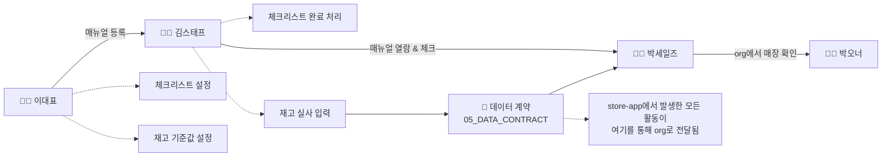

# 03_USER_FLOW — 프로덕트 전체 여정 (공유)

> 오너: Sara / 상태: **초안 샘플 — Week 1 확정 필요**
> 이 문서는 두 스택을 가로지르는 흐름만 다룬다. store-app 안의 세부 화면 흐름은 `store-app/docs/03_USER_FLOW.md`, toss-org 안은 `toss-org/docs/03_USER_FLOW.md`에서 각각 상세화한다.
> 근거: 00_WHY §5 (Demo Day 한 줄 시나리오), 01_PERSONAS, 02_PRD §0

---

## 전체 여정 (Demo Day 한 줄 시나리오의 확장판)



---

## 단계별 상세

### 1단계 — 이대표: 매뉴얼/체크리스트/재고 기준 설정 (최초 1회성 작업)

| 순서 | 화면 | 행동 | 비고 |
|---|---|---|---|
| 1-1 | 로그인/매장 등록 | 최초 가입, 매장 정보 입력 | `[확인필요]` 로그인 방식 (전화번호? 이메일?) |
| 1-2 | 매뉴얼 등록 | 사진 + 짧은 텍스트로 매뉴얼 작성 | 5분 이내 완료가 목표 (02_PRD) |
| 1-3 | 체크리스트 설정 | 오픈/마감 체크리스트 항목 등록 | 기본 템플릿 제공 여부는 `[확인필요]` |
| 1-4 | 재고 기준값 설정 | 품목별 "부족" 기준 수량 입력 | |

**분기:** 매뉴얼이 하나도 없는 상태에서 김스태프가 먼저 접속하면? → 빈 상태(Empty State) 처리 필요 (07_VOICE_AND_TONE 참조)

### 2단계 — 김스태프: 현장에서 즉시 사용 (반복 작업, 매 근무일)

| 순서 | 화면 | 행동 | 비고 |
|---|---|---|---|
| 2-1 | 진입 (로그인 최소화) | 링크 또는 QR로 즉시 접근 | 앱 설치 요구 없어야 함 (01_PERSONAS) |
| 2-2 | 매뉴얼 열람 | 필요한 매뉴얼 검색 없이 상황별로 찾음 | "지금 마감 시간"이면 마감 체크리스트가 먼저 노출 |
| 2-3 | "다 봤어요" 체크 | 학습 완료 표시 | 감시가 아니라 진행 표시로 느껴지게 |
| 2-4 | 체크리스트 완료 처리 | 오픈/마감 항목 체크 | 완료 시점이 이대표 대시보드에 반영 |
| 2-5 | 재고 실사 입력 | 한 손으로 수량 입력 | 기준값 이하면 "부족" 알림 트리거 |

**분기:** 체크리스트 항목을 다 못 채우고 퇴근하면? → `[확인필요]` 미완료 상태로 그냥 남기는지, 알림을 보내는지

### 3단계 — 데이터 계약 (store-app → toss-org)

2단계에서 발생한 활동(매뉴얼 등록 수, 학습 완료 여부, 체크리스트 완료율, 재고 알림 발생 여부)이 Apex REST 엔드포인트를 통해 toss-org로 전달된다. 필드 정의는 `05_DATA_CONTRACT.md` 참조.

### 4단계 — 박세일즈: org에서 매장 상태 확인 (반복 작업, 필요 시)

| 순서 | 화면 | 행동 | 비고 |
|---|---|---|---|
| 4-1 | 매장 리스트뷰 | 활성/방치 매장 필터링 | 도입 상태 필드 기준 |
| 4-2 | 매장 레코드 페이지 | 등록 매뉴얼 수, 직원 학습 완료율 확인 | store-app 활동이 반영된 값 |
| 4-3 | (선택) 대응 | 방치 매장에 연락, 부가서비스 제안 등 | 이번 스코프의 데모 대상은 아님 |

### 5단계 — 박오너: 지표로 집계 확인 (Demo Day 핵심 대상 아님, Nice-to-have)

박세일즈 화면에서 자연 집계되는 도입률·활성도 숫자를 확인. 별도 화면 개발 없음 (02_PRD §1 참조).

---

## 시간 흐름 예시 (하루 시나리오)

```
아침  이대표: (최초 1회만) 신메뉴 매뉴얼 추가
피크타임 중  김스태프: 폰으로 "재료 손질법" 매뉴얼 확인 → 사람에게 안 물어봄
마감 시간  김스태프: 마감 체크리스트 5개 완료 처리, 재고 실사 입력 → 우유 부족 알림 발생
그날 저녁  이대표: 대시보드에서 마감 체크 완료 확인, 우유 부족 알림 확인
(비동기)  박세일즈: org 리스트뷰에서 이 매장이 "활성" 상태로 정렬되어 있음을 확인
```

---

## 리뷰 세션 안건
1. `[확인필요]` 항목들 — 로그인 방식, 체크리스트 기본 템플릿 여부, 미완료 처리 방식
2. 이 문서 확정 후 store-app/toss-org 각 스택의 03_USER_FLOW를 이 흐름 기준으로 상세화
3. 승우(Integration Lead)가 3단계(데이터 계약) 파트를 가장 먼저 검토할 것