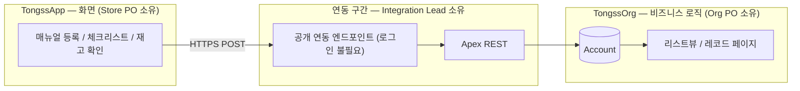

# 01_SYSTEM_MAP — App ↔ Org 전체 구조

> 오너: Integration Lead(승우)

---

## 전체 구조

---

## 누가 뭘 소유하나

| 구간 | 소유 | 상세 문서 |
|---|---|---|
| 화면, 데이터 발생 | Store PO | `TongssApp/docs/03_USER_FLOW.md`, `05_DATA.md` |
| 공개 연동 엔드포인트, Apex REST (연동 구간) | Integration Lead | `02_API_CONTRACT.md`, `03_DATA_FLOW.md` |
| Account 필드·권한 | Org PO / Platform Lead | `TongssOrg/docs/02_FIELD_GUIDE.md`, `05_PERMISSION.md` |

---

## 이 문서가 다루지 않는 것

- 화면 디자인 → `TongssApp/docs/`
- Object/필드 설계 이유 → `TongssOrg/docs/01_OBJECT_MODEL.md`, `02_FIELD_GUIDE.md`
- 필드 목록 자체 → `../../docs/04_DATA_CONTRACT.md`
- **사장·직원이 TongssApp에 들어가는 방법(Entry Code)** → `TongssApp/docs/03_USER_FLOW.md` §0. 위 다이어그램의 "공개 연동 엔드포인트"는 사람이 아니라 **시스템(TongssApp 서버 → TongssOrg)** 간 통신이며, Entry Code와는 무관합니다.
