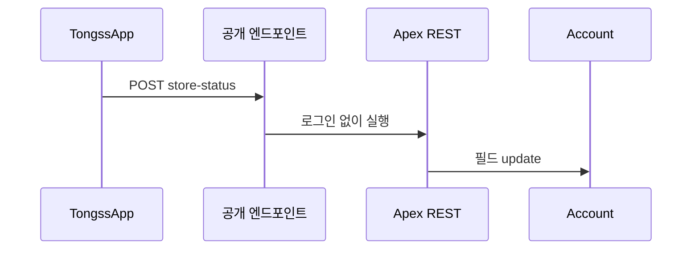

# 02_API_CONTRACT — API 목록

> 오너: Integration Lead(승우)
> 필드 하나하나의 정의는 여기 없습니다 — `../../docs/04_DATA_CONTRACT.md`(shared)가 유일한 진실입니다.

---

## API 목록

| API | 방향 | 인증 | 상태 | 상세 |
|---|---|---|---|---|
| `POST /services/apexrest/tongss/store-status/*` | TongssApp → TongssOrg | 없음 (공개 엔드포인트) | `[확인필요]` | `TongssOrg/docs/06_AUTOMATION.md` (StoreRestService) |

역방향(Org → App) API는 없습니다 (`../../docs/04_DATA_CONTRACT.md` §1).

> ⚠️ 이 "인증 없음"은 **시스템 간 통신**에 대한 이야기입니다. 사람(사장·직원)이 TongssApp에 들어가는 방법(Entry Code)과는 다른 이야기입니다 — `TongssApp/docs/03_USER_FLOW.md` §0 참조.

---

## 호출 순서

---

## 체크

- [ ] 이 표의 엔드포인트가 실제 `urlMapping`과 일치하는가
- [ ] 계약에 없는 필드를 주고받고 있지 않은가 (`../../docs/04_DATA_CONTRACT.md` 기준)
