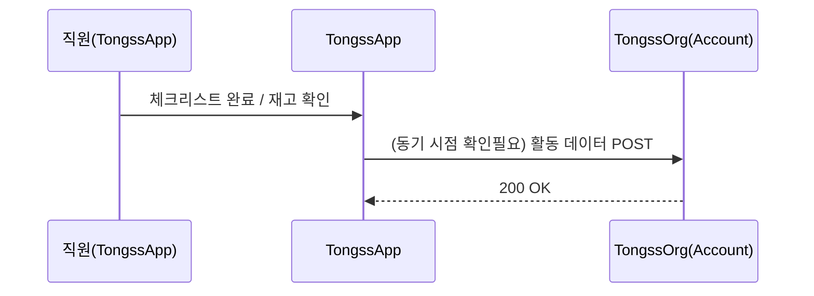

# 03_DATA_FLOW — 데이터 이동

> 오너: Integration Lead(승우)

---

## 누가 보내고 누가 받나

| | 보낸다 | 받는다 |
|---|---|---|
| TongssApp | ✅ 매뉴얼·체크리스트·재고 확인 활동 | — |
| TongssOrg | — | ✅ Account 필드 갱신 |

---

## 언제 동기화되나

`[확인필요]` 즉시 전송 vs 배치(일 1회) — Week 2 결정 사항 (`../../docs/04_DATA_CONTRACT.md` §1)

---

## 실패하면?

→ `04_ERROR_HANDLING.md` 참조 (여기서 중복 설명하지 않음)

## 상세 필드 정의

→ `../../docs/04_DATA_CONTRACT.md` (여기서 중복 설명하지 않음)
