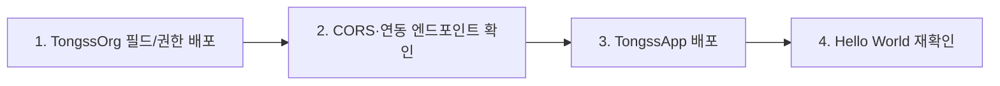

# 05_DEPLOYMENT_FLOW — 배포 순서

> 오너: Integration Lead(승우)

---

## 배포 순서 (둘 다 바뀔 때)

**왜 이 순서인가:** TongssApp이 먼저 배포되면 아직 없는 필드로 요청을 보내 에러가 납니다. Org를 먼저 세팅합니다.

---

## 환경 정보

| 항목 | 값 |
|---|---|
| TongssApp 배포처 | `[확인필요]` (`../../docs/03_PROJECT_GUIDE.md` Week 1 결정) |
| TongssApp URL (dev) | `[확인필요]` |
| TongssOrg 종류 | `[확인필요]` |
| 연동 엔드포인트 도메인 | `[확인필요]` |
| CORS 등록 도메인 | `[확인필요]` |

---

## 체크

- [ ] 값이 바뀔 때마다 위 표 갱신
- [ ] 트랙을 넘는 변경(배포처 변경 등)은 `../../docs/07_DECISIONS.md`에도 기록
